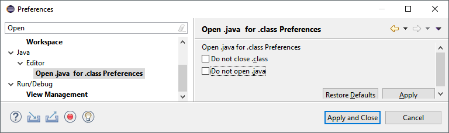

# Open .java file for .class file

A simple Eclipse plugin to open .java file for a .class file, if the .java file is present in one of the open Java projects in Eclipse workspace.

## How does it work ?

Monitors the opening of a .class editor. Then uses the JDT Java search mechanism to locate the .java file in any of the Java projects in the Eclipse workspace. It also tries to move the same caret offset in .java file. By default closes the .class file, however by setting a preference you can opt-in to not close the .class file.

The key aspect is that the projects may not even be related via project dependencies.

## Update site

Install the plugin using update site URL:

https://sandipchitale.github.io/odjfdc/OpenDotJavaForDotClassUpdateSite/site.xml